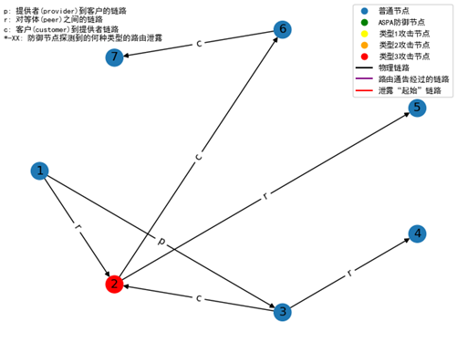

# BGP-ASPA

BGP 路由模拟仿真平台，北京邮电大学毕业设计《ASPA对域间路由泄露攻击的防御能力的研究与仿真》源代码

主要参考来源： [SSBGP](https://github.com/ssbgp/simulator)

域间路由关系详细定义请见： [here](https://www.cs.princeton.edu/~jrex/papers/sigmetrics00.long.pdf)

数据来源：[CAIDA](https://www.caida.org/catalog/datasets/as-relationships)

---

## 域间路由商业关系定义

    注意：本模拟器的链路都是单向的！！！

1. 导出提供者路由：AS在与提供者交换路由信息时，可以导出自己的路由和客户的路由，但不能导出从其他提供者或对等体学习到的路由。也就是说，AS
   不为其提供者提供中转服务。

2. 导出客户路由：在与客户交换路由信息时，AS 可以导出其路由，以及从其提供者和对等方学习到的路由。也就是说，AS 确实为其客户提供中转服务。

3. 导出对等体路由：AS 在与对等点交换路由信息时，可以导出自己的路由和客户的路由，但不能导出从其他提供商或对等点学习到的路由。即一个AS不为其对等体提供中转服务

   topo文件中，后一个为源AS，前一个为目的AS

- **C** - 客户路由，即从客户AS导出的路由（来自客户AS，从客户指向提供商），根据规则，它能够传递到任意邻居

- **P** - 提供商路由，即从提供商AS导出的路由（来自提供商AS，从提供商指向客户），根据规则，它只能传递给客户

- **R** - 对等体路由，即从对等体AS导出的路由（来自对等体AS，从对等体指向对等体），根据规则，它只能传递给客户

规则：

客户能够将通告发送给客户、提供商、对等体；而提供商、对等体只能把路由通告发送给客户

从**客户链路**学习来的路由发送给所有邻居，从**邻居链路**和**提供者链路**学习来的路由只发送给客户

---

## 程序框架图

<div style="text-align: center;">


</div>

---

## 输入

### 输入格式

程序运行至少需要一个拓扑文件（`.topo`文件）作为输入，下图展示了拓扑文件格式的一个例子。

<div style="text-align: center;">


</div>

拓扑文件中分为两个部分，第一部分为AS节点信息，第二部分为链路信息，分别用 **node** 和 **link** 进行标识。

节点信息部分，第一个参数是一个自然数，为 AS 节点编号，这个数字对于每一个节点来说都是唯一的，如果出现节点编号重复的情况，模拟器在读取拓扑文件时报错。

第二个参数是节点采用的协议，每个 AS 节点可能会采用不同的路由协议，不过本文将主要探讨在BGP协议下的路由泄露与防御。然而，该参数也可用于设置特定节点，将其标志为泄露节点/部署了ASPA的防御节点。

最后一个属性是路由通告间隔（单位：毫秒），用于随机路由结果，本文的最终目的在于监测ASPA的防御性能而非BGP路由性能，故该参数均设置为0。

链路信息部分，第一个参数为目的节点（Target AS），第二个参数为源节点（Source AS），第三个参数为链路中双方节点的关系。

节点关系可取 P、C、R 三个字母（大小写不敏感）。

P代表 **Provider** 关系，如链路 link=3 | 1 | P 代表了 AS1 是 AS3 的 Provider ，并且有一条由 AS1 指向 AS3 的链路。

C代表 **Customer** 关系，如链路 link=2 | 3 | C 代表了 AS3 是 AS2 的 Customer ，并且有一条由 AS3 指向 AS2 的链路。 R 代表
Peer 关系，如链路 link=2 |
1 |

R代表了 AS1 是 AS2 的 **Peer** ，并且有一条由 AS1 指向 AS2 的链路。

请注意，在本模拟器中，所有输入链路都是单向的，即是Peer关系的链路也是如此。如果要实现双向链路的效果，需要添加额外一行源节点与目标节点参数互换的链路数据。

### 启动项

程序的启动也需要启动参数，主要启动参数介绍如下：

- **-t**：_必须的参数_，在该参数后应当输入需要运行的拓扑文件的路径。
- **-d**：_必须的参数_，该参数指示了最初的路由通告应当在哪个节点发出，本模拟器支持多个起始路由通告AS节点。该参数后需要至少一个自然数，空格间隔，并且这些数字必须是拓扑文件中存在的AS节点编号。
- **-c**：_必须的参数_，在该参数后应当输入一个正整数，该参数指定了模拟器将会重复运行几次。
- **-rn**：_可选的参数_，输入该参数后，模拟器将输出节点信息 `Nodes.csv` 。
- **-tr**：_可选的参数_，输入该参数后，模拟器将输出路由链路信息 `Trace.txt` 。
- **-meta**：_可选的参数_，输入该参数后，模拟器将输出运行的程序基本信息 `Meta.txt` 。
- **-o**：_可选的参数_，该参数后需要添加文件路径，指示了输出文件存放的目录，如果不指定该参数，将默认把所有输出文件存放至程序工程文件目录。

以下是一段示例的启动命令：

```shell
-t ./topo/test.topo -d 1 -c 1 -rn -tr -meta -o ./output
```

该命令表示，在工程文件目录下的 `topo` 文件夹中读取拓扑文件 `test.topo` ，路由通告由 AS1
节点发起，程序仅运行一次，需要输出节点信息、链路信息与程序信息，并且所有输出信息都应当放到工程文件目录的 `output` 文件夹下。


---

## 输出

模拟运行结束后，将在指定的输出路径输出运行结果，所有的输出文件如下所示：

- `Base.csv`: 必定会生成，描述了模拟运行的结果，包括采用的随机种子、全部路由结束的时间等
- `Meta.txt`: 参数 **-meta** 生成，描述了模拟程序的参数设定和时间信息等
- `Nodes.csv`: 参数 **-rn** 生成，描述了各个节点在运行结束后的情况，如本地优先级、下一跳节点等
- `Trace.txt`: 参数 **-tr** 生成，追踪了路由通告和节点学习路由的信息，包含AS-path的展示

---

## 节点类型定义

本文假定所有网络拓扑中的节点都运行 BGP 协议，并且 AS 节点之间严格遵守无谷模型。

默认情况下，网络拓扑的每两个 AS 节点之间的链路都必定是 Provider、Customer、Peer 三种关系的一种。

为了满足路由策略，三种不同类型的路由分别具有不同的本地优先级（即 Local_Pref ，在本模拟器中，数值越高优先级越高）。

- Customer 路由的 Local_Pref 为 **300000**；
- Peer 路由的 Local_Pref 为 **200000**；
- Provider 路由的 Local_Pref 为 **100000**。

由于拥有最高优先级，发送给Customer的路由通告是无条件的，而发送给Provider和Peer的路由则被路由转发前的本地优先级所限制。由此便遵守了无谷模型的路由策略。

在这样的基础上，定义如下所示的五种不同类型的AS节点：

- **类型 0** - 普通节点
- **类型 1** - 泄露者，将 Provider/Peer 的路由泄露给其他的 Peer，即发生 Provider-Peer 泄露和 Peer-Peer 泄露
- **类型 2** - 泄露者，将 Provider/Peer 的路由泄露给其他的 Provider，即发生 Provider-Provider 泄露和 Peer-Provider 泄露
- **类型 3** - 包含以上两种情况的泄露者节点
- **类型 4** - 部署了ASPA 的防御节点

类型 1、2、3 节点是“泄露者”节点。他们分别向不同关系的邻居节点发送根据路由策略本不应当泄露的路由信息。

类型1的泄露者实现路由泄露的原理是，当路由通告转发至泄露者节点后，泄露者节点将会强制把具有 Peer 关系的邻居节点的本地优先级提高到
300000 ，即 Customer 路由的级别，使得其被无条件转发。

类型2的泄露者实现了类似的功能，不同之处在于，类型2泄露节点会且仅会把 Provider 关系的路由提高到 Customer 路由的优先级。

而类型3的泄露节点则包含了以上两种节点的所有功能。

类型4的节点是部署了ASPA的防御节点。一旦发现泄露的路由，防御AS将会判断该路由通告为泄露路由并在路由拓扑图上显示。防御节点将不会转发任何被判断为泄露路由的路由信息，并且会通过标志字符串标识出泄露路由的来源链路。

泄露的路由标志字符串和路由泄露类型的对应关系如下：

<div style="text-align: center;">

| 泄露路由标志 | 路由泄露类型              |
|:-------|---------------------|
| *-pr   | Provider-Peer泄露     |
| *-pc   | Provider-Provider泄露 |
| *-rr   | Peer-Peer泄露         |
| *-rc   | Peer-Provider泄露     |

</div>

---

## 示例

以下以一个简单的 BGP 网络拓扑作为示例，展示模拟器是如何进行运作的

- AS1 为路由通告始发节点，它是 AS3 的 Provider 、是 AS2 的 Peer 。
- AS2 属于类型3的泄露节点，它是 AS6 的 Customer 、 AS5 的 Peer 。
- AS3 是普通节点，它是 AS2 的 Customer ，也是 AS4 的 Peer 。
- AS6 是 AS7 的 Customer 。

<div style="text-align: center;">




</div>
